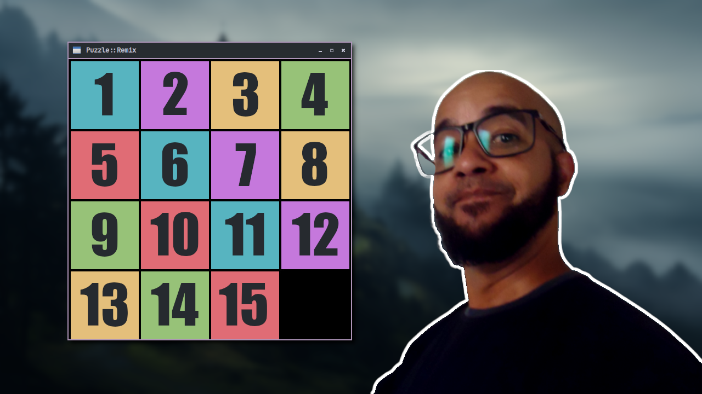

# puzzle
This repository stores a **Puzzle** game created with **C++** and **SFML**. 
> The step by step was done in a video on *Youtube in Portuguese*.

---

# Dependencies
+ [GNU GCC/g++](https:://gcc.gnu.org/)
+ [SFML](https://github.com/SFML/SFML)
+ [GNU Make](https://www.gnu.org/software/make/)

---

# Build and run
```bash
git clone https://github.com/terroo/puzzle
cd puzzle
make
```

---

# Watch video on Youtube
> <https://youtu.be/pKqWOObonUY>
[](https://youtu.be/pKqWOObonUY)


